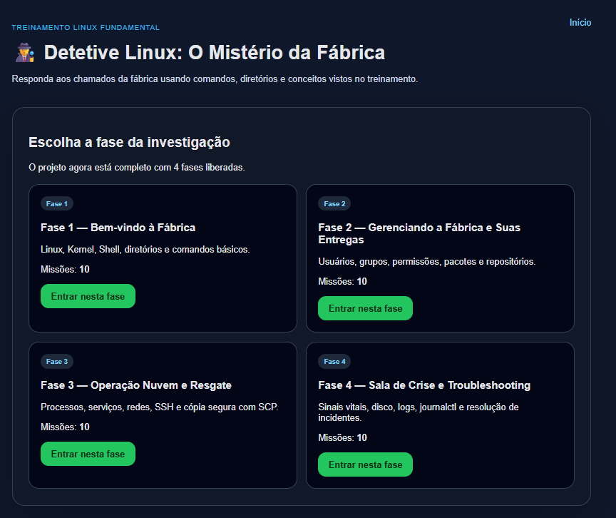
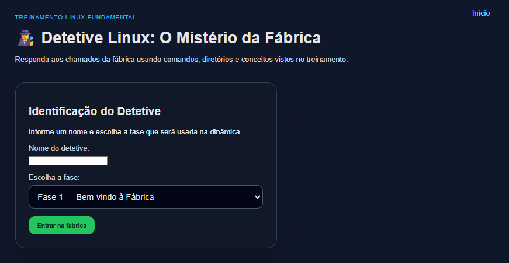
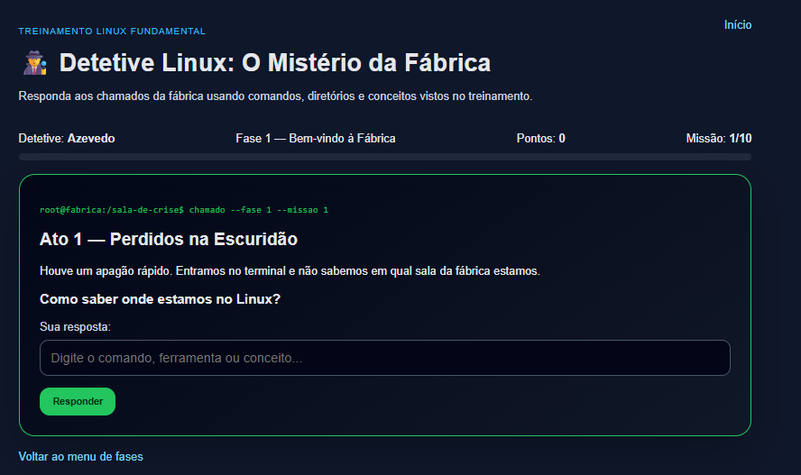

# 🕵️ Detetive Linux — O Mistério da Fábrica

Jogo web educativo feito com **Python** e **Django** para apoiar um treinamento básico/fundamental de Linux.

A proposta do projeto é transformar comandos Linux em uma dinâmica de detetive, usando a metáfora de uma **fábrica** para explicar conceitos técnicos de forma simples, visual e divertida.

O jogo foi pensado para treinamentos com públicos mistos, incluindo pessoas de **TI, Suporte, Infraestrutura, RH, Administrativo e áreas não técnicas**.

---

## 📌 Objetivo do Projeto

O objetivo do **Detetive Linux** é ajudar os participantes a perderem o medo da “tela preta” e entenderem comandos Linux por meio de situações práticas.

Em vez de apenas decorar comandos, o participante recebe uma missão, responde qual comando/conceito resolve o problema e recebe uma explicação curta sobre:

- o que o comando faz;
- por que ele deve ser usado;
- um exemplo prático de uso.

Exemplo:

```text
Pergunta: Como saber onde estamos no Linux?
Resposta: pwd
Explicação: O pwd mostra o diretório atual, funcionando como um GPS dentro da fábrica Linux.
```

---

## 🖼️ Screenshots

### Tela inicial



### Escolha de fase



### Tela de missão



---

## 🎮 Como Funciona o Jogo

O jogador assume o papel de um detetive chamado para resolver incidentes dentro da “Fábrica Linux”.

Cada fase possui 10 missões. Em cada missão, o jogo apresenta:

1. uma história curta;
2. uma pergunta;
3. um campo para digitar a resposta;
4. validação automática;
5. explicação após o acerto;
6. pontuação por missão concluída.

---

## 🧩 Fases Disponíveis

O projeto possui **04 fases**, totalizando **40 missões**.

### ✅ Fase 1 — Bem-vindo à Fábrica

Tema: conceitos básicos, diretórios e comandos fundamentais.

Comandos e conceitos abordados:

```bash
pwd
cd
/etc
/var/log
tail
touch
root
/tmp
rm
clear
```

---

### ✅ Fase 2 — Gerenciando a Fábrica e Suas Entregas

Tema: usuários, grupos, permissões e pacotes.

Comandos abordados:

```bash
useradd
passwd
groupadd
usermod
id
groups
chown
chmod
apt update
dnf install zabbix
```

---

### ✅ Fase 3 — Operação Nuvem e Resgate

Tema: processos, serviços, rede, SSH e SCP.

Comandos e ferramentas abordados:

```bash
systemctl start
systemctl status
systemctl enable
ps
top
kill
ping
ip addr
ssh
scp
```

---

### ✅ Fase 4 — Sala de Crise e Troubleshooting

Tema: monitoramento, logs e resolução de problemas.

Comandos e conceitos abordados:

```bash
uptime
top
free -h
df -h
du -sh
/var/log
tail -f
journalctl -xe
journalctl -u
systemctl restart
```

---

## 🛠️ Tecnologias Utilizadas

- **Python 3**
- **Django**
- **SQLite**
- **HTML**
- **CSS**

---

## 📁 Estrutura do Projeto

```text
jogo_detetive_linux/
├── manage.py
├── requirements.txt
├── README.md
├── screenshots/
│   ├── tela-inicial.png
│   ├── escolha-fase.png
│   └── missao.png
├── detetive_linux/
│   ├── __init__.py
│   ├── settings.py
│   ├── urls.py
│   ├── asgi.py
│   └── wsgi.py
└── game/
    ├── __init__.py
    ├── admin.py
    ├── apps.py
    ├── forms.py
    ├── models.py
    ├── urls.py
    ├── views.py
    ├── migrations/
    ├── management/
    │   └── commands/
    │       └── seed_missions.py
    ├── static/
    │   └── game/
    │       └── css/
    │           └── style.css
    └── templates/
        └── game/
            ├── base.html
            ├── home.html
            ├── start.html
            ├── mission.html
            └── finished.html
```

---

## 🚀 Como Executar o Projeto

### 1. Clone o repositório

```bash
git clone https://github.com/SEU_USUARIO/detetive-linux-fabrica.git
```

```bash
cd detetive-linux-fabrica
```

> Ajuste a URL acima conforme o endereço real do seu repositório no GitHub.

---

### 2. Crie um ambiente virtual

No Linux/macOS:

```bash
python3 -m venv venv
```

No Windows:

```bat
python -m venv venv
```

---

### 3. Ative o ambiente virtual

No Linux/macOS:

```bash
source venv/bin/activate
```

No Windows CMD:

```bat
venv\Scripts\activate
```

No Windows PowerShell:

```powershell
.\venv\Scripts\Activate.ps1
```

---

### 4. Instale as dependências

```bash
pip install -r requirements.txt
```

---

### 5. Execute as migrações

```bash
python manage.py migrate
```

---

### 6. Carregue as missões iniciais

```bash
python manage.py seed_missions
```

Esse comando popula o banco de dados com as 40 missões do jogo.

---

### 7. Inicie o servidor

```bash
python manage.py runserver
```

Acesse no navegador:

```text
http://127.0.0.1:8000/
```

---

## 👨‍🏫 Uso em Sala de Aula

Este projeto pode ser usado de duas formas:

### 1. Modo individual

Cada participante acessa o jogo em seu próprio computador e responde às missões.

### 2. Modo instrutor/projetor

O instrutor projeta o jogo na tela e a turma responde em conjunto.

Exemplo de dinâmica:

```text
Instrutor: Como sabemos em qual diretório estamos?
Turma: pwd!
```

Depois do acerto, o instrutor reforça a explicação exibida pelo jogo.

---

## 🧑‍🏫 Gabarito para o Professor

### Fase 1

```bash
pwd
cd
/etc
/var/log
tail
touch
root
/tmp
rm
clear
```

### Fase 2

```bash
useradd
passwd
groupadd
usermod
id
groups
chown
chmod
apt update
dnf install zabbix
```

### Fase 3

```bash
systemctl start
systemctl status
systemctl enable
ps
top
kill
ping
ip addr
ssh
scp
```

### Fase 4

```bash
uptime
top
free -h
df -h
du -sh
/var/log
tail -f
journalctl -xe
journalctl -u
systemctl restart
```

---

## 🗃️ Banco de Dados

O projeto utiliza **SQLite** por padrão, facilitando a execução local sem necessidade de configurar banco externo.

O arquivo do banco é criado após executar:

```bash
python manage.py migrate
```

As missões são carregadas por meio do comando:

```bash
python manage.py seed_missions
```

---

## 🔐 Django Admin

Para acessar o painel administrativo, crie um superusuário:

```bash
python manage.py createsuperuser
```

Depois acesse:

```text
http://127.0.0.1:8000/admin/
```

No painel admin é possível gerenciar:

- missões;
- respostas esperadas;
- respostas alternativas;
- pontuação;
- sessões dos jogadores;
- histórico de respostas.

---

## ✏️ Como Personalizar as Missões

As missões iniciais ficam no arquivo:

```text
game/management/commands/seed_missions.py
```

Para adicionar uma nova missão, siga o modelo existente:

```python
{
    'phase': 1,
    'order': 1,
    'title': 'Título da missão',
    'story': 'História da missão',
    'question': 'Pergunta exibida ao jogador',
    'expected_answer': 'resposta',
    'aliases': 'resposta alternativa,resposta alternativa 2',
    'command_example': 'exemplo de comando',
    'explanation': 'Explicação exibida após o acerto',
}
```

Depois de alterar o arquivo, execute novamente:

```bash
python manage.py seed_missions
```

---

## 📚 Público-Alvo

Este projeto foi pensado para:

- alunos iniciantes em Linux;
- equipes de suporte técnico;
- equipes de infraestrutura;
- treinamentos internos de TI;
- profissionais de áreas administrativas que precisam entender conceitos básicos de tecnologia;
- instrutores que desejam ensinar Linux de forma lúdica.

---

## 🧠 Conceito Didático

A principal metáfora do projeto é a **Fábrica Linux**:

- diretórios são salas;
- usuários são funcionários;
- grupos são departamentos;
- permissões são chaves e cadeados;
- processos são operários;
- serviços são guardas;
- logs são diários;
- rede são estradas;
- SSH é um túnel secreto;
- SCP é uma cápsula de transporte segura.

Essa abordagem ajuda a tornar conceitos técnicos mais acessíveis para qualquer público.

---

## 🤝 Contribuições

Contribuições são bem-vindas!

Sugestões de melhoria:

- ranking dos participantes;
- modo instrutor;
- temporizador por fase;
- exportação de resultados;
- novos pacotes de perguntas;
- suporte a múltiplas turmas;
- dashboard de desempenho;
- autenticação de jogadores.

---

## 📄 Licença

Este projeto pode ser utilizado para fins educacionais e treinamentos internos.

Sugestão: utilize uma licença open source como **MIT License**, caso queira permitir uso, cópia, modificação e distribuição do projeto.

---

## 👨‍💻 Autor

Desenvolvido como material de apoio para treinamento básico/fundamental de Linux.

Autor: **Leonardo Azevedo**

---

## ⭐ Apoie o Projeto

Se este projeto ajudou no seu treinamento ou estudo, considere deixar uma estrela no repositório.

```text
⭐ Star no GitHub ajuda outras pessoas a encontrarem o projeto.
```
